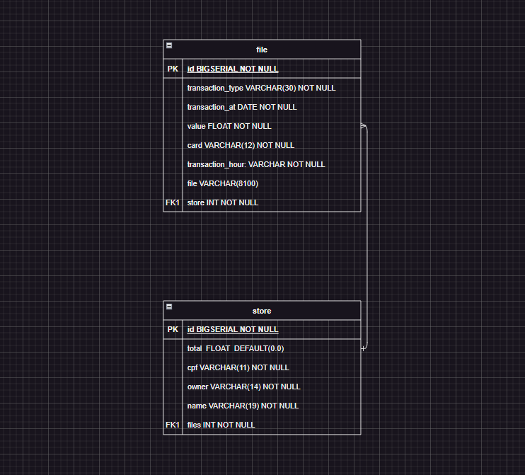

# CNAB File Storage

## Tabela de Conteúdos

- [Visão Geral](#1-visão-geral)
- [Diagrama ER](#2-diagrama-er)
- [Rode o projeto em sua máquina](#3-rode-o-projeto-em-sua-máquina)
  - [Criando seu ambiente virtual](#31-criando-seu-ambiente-virtual)
  - [Instalando Dependências](#32-instalando-dependências)
  - [Variáveis de Ambiente](#33-variáveis-de-ambiente)
  - [Migrations](#34-migrations)
  - [Rodando o servidor](#35-rodando-o-servidor)
- [Endpoints](#4-endpoints)

---

## 1. Visão Geral

Este é um projeto back-end criado com a finalidade de armazenar arquivos CNAB em um banco de dados relacional, no projeto é usado o [SQLite](https://sqlite.org/index.html) por ser um projeto de pequeno porte. Esta aplicação não possuí um deploy então ela roda apenas localmente.

Logo abaixo temos a lista de tecnologias usadas:

- [Python](https://www.python.org/downloads/)
- [Django](https://www.djangoproject.com/)
- [rest-framework](https://www.django-rest-framework.org/)
- [python-dotenv](https://pypi.org/project/python-dotenv/)
- [SQLite](https://sqlite.org/index.html)

URL base da aplicação: http://localhost:8000/api/files/

---

## 2. Diagrama ER

[ Voltar para o topo ](#tabela-de-conteúdos)

Diagrama ER da API com suas relações entre as tabelas do banco de dados:



---

## 3. Rode o projeto em sua máquina

[ Voltar para o topo ](#tabela-de-conteúdos)

### 3.1. Criando seu ambiente virtual

Clone o projeto em sua máquina e dentro de seu diretório principal execute o comando:

```shell
python -m venv venv
```

#### 3.1.1. Para ativar seu ambiente virtual use o comando:

Windows:

```shell
.\venv\Scripts\activate
```

Linux:

```shell
source venv/bin/activate
```

#### 3.1.2. Para desativar seu ambiente virtual use o comando:

Windows ou Linux:

```shell
deactivate
```

### 3.2. Instalando Dependências

Com seu ambiente virtual ativado instale as dependências com o comando:

```shell
pip install -r requirements.txt
```

### 3.3. Variáveis de Ambiente

Em seguida, crie um arquivo **.env**, copiando o formato do arquivo **.env.example**:

```
cp .env.example .env
```

Configure suas variáveis de ambiente com suas credenciais.

### 3.4. Migrations

Execute as migrations com o comando:

```
python manage.py migrate
```

### 3.5. Rodando o servidor

Para rodar o servidor execute o comando:

```
python manage.py runserver
```

---

## 4. Endpoints

[ Voltar para o topo ](#tabela-de-conteúdos)

```
Base URL: http://localhost:8000/api/
```

### Índice

- [Files](#1-login)
  - [POST - files/](#11-enviando-o-arquivo-e-armazenando-o-mesmo)
  - [GET - files/](#12-listando-todas-as-transações-no-banco)

---

## 1. **Files**

[ Voltar para os Endpoints ](#4-endpoints)

O objeto file é definido como:

| Campo            | Tipo   | Descrição                                        |
| ---------------- | ------ | ------------------------------------------------ |
| id               | number | ID da Transação armazanada.                      |
| transaction_type | string | Tipo de transação realizada.                     |
| transaction_at   | string | Data que a transação foi realizada.              |
| value            | string | Valor da transação.                              |
| card             | string | Cartão usado.                                    |
| transaction_hour | string | Hora que a transação foi reaizada.               |
| store            | string | Loja beneficiária da transação.                  |
| file             | string | Arquivo CNAB usado para armazenar as transações. |

O objeto store é definido como:

| Campo | Tipo   | Descrição             |
| ----- | ------ | --------------------- |
| id    | number | ID da loja.           |
| total | string | Saldo total da loja.  |
| cpf   | string | CPF do dono da loja.  |
| owner | string | Nome do dono da loja. |
| name  | string | Nome da loja.         |

### Endpoints

| Método | Rota   | Descrição                               |
| ------ | ------ | --------------------------------------- |
| POST   | files/ | Enviando Arquivo e armazenando o mesmo. |
| GET    | files/ | Listando todas as transações no banco.  |

---

### 1.1. **Enviando o arquivo e armazenando o mesmo**

[ Voltar para os Endpoints ](#4-endpoints)

### `files/`

### Exemplo de Request:

```
POST files/
Host: http://localhost:8000/api/
Authorization: None
Content-type: application/json
```

### Corpo da Requisição:

#### Cada transação contém exatamente 81 caracteres.

```json
{
  "file": "3201903010000014200096206760174753****3153153453JOÃO MACEDO   BAR DO JOÃO
5201903010000013200556418150633123****7687145607MARIA JOSEFINALOJA DO Ó - MATRIZ
3201903010000012200845152540736777****1313172712MARCOS PEREIRAMERCADO DA AVENIDA
2201903010000011200096206760173648****0099234234JOÃO MACEDO   BAR DO JOÃO
1201903010000015200096206760171234****7890233000JOÃO MACEDO   BAR DO JOÃO
2201903010000010700845152540738723****9987123333MARCOS PEREIRAMERCADO DA AVENIDA
2201903010000050200845152540738473****1231231233MARCOS PEREIRAMERCADO DA AVENIDA
3201903010000060200232702980566777****1313172712JOSÉ COSTA    MERCEARIA 3 IRMÃOS
1201903010000020000556418150631234****3324090002MARIA JOSEFINALOJA DO Ó - MATRIZ
5201903010000080200845152540733123****7687145607MARCOS PEREIRAMERCADO DA AVENIDA
2201903010000010200232702980568473****1231231233JOSÉ COSTA    MERCEARIA 3 IRMÃOS
3201903010000610200232702980566777****1313172712JOSÉ COSTA    MERCEARIA 3 IRMÃOS
4201903010000015232556418150631234****6678100000MARIA JOSEFINALOJA DO Ó - FILIAL
8201903010000010203845152540732344****1222123222MARCOS PEREIRAMERCADO DA AVENIDA
3201903010000010300232702980566777****1313172712JOSÉ COSTA    MERCEARIA 3 IRMÃOS
9201903010000010200556418150636228****9090000000MARIA JOSEFINALOJA DO Ó - MATRIZ
4201906010000050617845152540731234****2231100000MARCOS PEREIRAMERCADO DA AVENIDA
2201903010000010900232702980568723****9987123333JOSÉ COSTA    MERCEARIA 3 IRMÃOS
8201903010000000200845152540732344****1222123222MARCOS PEREIRAMERCADO DA AVENIDA
2201903010000000500232702980567677****8778141808JOSÉ COSTA    MERCEARIA 3 IRMÃOS
3201903010000019200845152540736777****1313172712MARCOS PEREIRAMERCADO DA AVENIDA "
}
```

### Exemplo de Response:

```
201 Created
```

```json

[
  {
    "id": 1,
    "transaction_type": "financiamento",
    "transaction_at": "2019-03-01",
    "value": 142.0,
    "card": "4753****3153",
    "transaction_hour": "15:34:53",
    "store": {
      "id": 1,
      "total": -102.0,
      "cpf": "09620676017",
      "owner": "JOÃO MACEDO   ",
      "name": "BAR DO JOÃO        "
    }
  },
  {
    "id": 2,
    "transaction_type": "recebimento empréstimo",
    "transaction_at": "2019-03-01",
    "value": 132.0,
    "card": "3123****7687",
    "transaction_hour": "14:56:07",
    "store": {
      "id": 2,
      "total": 230.0,
      "cpf": "55641815063",
      "owner": "MARIA JOSEFINA",
      "name": "LOJA DO Ó - MATRIZ "
    }
  },
  {
    "id": 3,
    "transaction_type": "financiamento",
    "transaction_at": "2019-03-01",
    "value": 122.0,
    "card": "6777****1313",
    "transaction_hour": "17:27:12",
    "store": {
      "id": 3,
      "total": 681.2,
      "cpf": "84515254073",
      "owner": "MARCOS PEREIRA",
      "name": "MERCADO DA AVENIDA "
    }
  },
  {
    "id": 4,
    "transaction_type": "boleto",
    "transaction_at": "2019-03-01",
    "value": 112.0,
    "card": "3648****0099",
    "transaction_hour": "23:42:34",
    "store": {
      "id": 1,
      "total": -102.0,
      "cpf": "09620676017",
      "owner": "JOÃO MACEDO   ",
      "name": "BAR DO JOÃO        "
    }
  },
  {
    "id": 5,
    "transaction_type": "débito",
    "transaction_at": "2019-03-01",
    "value": 152.0,
    "card": "1234****7890",
    "transaction_hour": "23:30:00",
    "store": {
      "id": 1,
      "total": -102.0,
      "cpf": "09620676017",
      "owner": "JOÃO MACEDO   ",
      "name": "BAR DO JOÃO        "
    }
  },
  ...
]

```

---

### 1.2. **Listando todas as transações no banco**

[ Voltar para os Endpoints ](#5-endpoints)

### `files/`

### Exemplo de Request:

```
GET files/
Host: http://localhost:8000/api/
Authorization: None
Content-type: application/json
```

### Corpo da Requisição:

```json
None
```

### Exemplo de Response:

```
200 OK
```

```json

[
  {
    "id": 1,
    "transaction_type": "financiamento",
    "transaction_at": "2019-03-01",
    "value": 142.0,
    "card": "4753****3153",
    "transaction_hour": "15:34:53",
    "store": {
      "id": 1,
      "total": -102.0,
      "cpf": "09620676017",
      "owner": "JOÃO MACEDO   ",
      "name": "BAR DO JOÃO        "
    }
  },
  {
    "id": 2,
    "transaction_type": "recebimento empréstimo",
    "transaction_at": "2019-03-01",
    "value": 132.0,
    "card": "3123****7687",
    "transaction_hour": "14:56:07",
    "store": {
      "id": 2,
      "total": 230.0,
      "cpf": "55641815063",
      "owner": "MARIA JOSEFINA",
      "name": "LOJA DO Ó - MATRIZ "
    }
  },
  {
    "id": 3,
    "transaction_type": "financiamento",
    "transaction_at": "2019-03-01",
    "value": 122.0,
    "card": "6777****1313",
    "transaction_hour": "17:27:12",
    "store": {
      "id": 3,
      "total": 681.2,
      "cpf": "84515254073",
      "owner": "MARCOS PEREIRA",
      "name": "MERCADO DA AVENIDA "
    }
  },
  {
    "id": 4,
    "transaction_type": "boleto",
    "transaction_at": "2019-03-01",
    "value": 112.0,
    "card": "3648****0099",
    "transaction_hour": "23:42:34",
    "store": {
      "id": 1,
      "total": -102.0,
      "cpf": "09620676017",
      "owner": "JOÃO MACEDO   ",
      "name": "BAR DO JOÃO        "
    }
  },
  {
    "id": 5,
    "transaction_type": "débito",
    "transaction_at": "2019-03-01",
    "value": 152.0,
    "card": "1234****7890",
    "transaction_hour": "23:30:00",
    "store": {
      "id": 1,
      "total": -102.0,
      "cpf": "09620676017",
      "owner": "JOÃO MACEDO   ",
      "name": "BAR DO JOÃO        "
    }
  },
  ...
]

```
